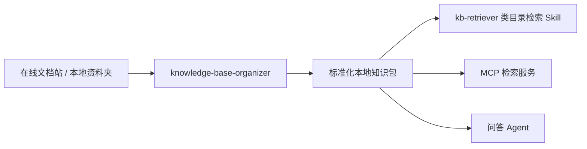

# knowledge-base-organizer

> 把在线文档站或本地资料夹，整理成一个适合后续检索、MCP 封装和 Agent 问答的本地知识包。

这是一个面向 Codex 的 **知识库整理 Skill**。  
它不负责直接回答知识库问题，而是负责做问答之前最关键的前置工作：

1. 识别知识源
2. 保留原始来源
3. 抽取正文
4. 规范化为 Markdown
5. 处理图片与 OCR
6. 生成目录索引和结构化 manifest

如果你现在的知识源是：

- 一个公开在线文档站
- 一个混乱的本地文件夹
- 一个混合了 Markdown / PDF / Excel / 图片 的内部资料目录

这个 Skill 的职责就是先把它变成一个 **检索友好的本地知识包**。

---

## 它解决什么问题

很多知识库项目的问题不在“检索模型不够强”，而在“源知识本身没有被整理成适合检索的形态”。

常见症状包括：

- 文档散落在不同子目录里，没有统一目录索引
- 在线文档只能浏览，不能稳定落地到本地
- PDF、Excel、图片内容难以进入后续检索链路
- 无法从检索结果稳定追溯回原始来源
- 后续想做 MCP、Skill 检索、甚至替代传统向量 RAG，但缺少一个统一的本地知识包格式

`knowledge-base-organizer` 做的不是“回答问题”，而是先把这些问题清掉。

---

## 它适合什么场景

适合：

- 把公开在线文档站同步为本地知识库
- 把本地混合文档目录整理成结构更清晰的知识包
- 为后续 `kb-retriever` 一类目录式检索 Skill 做前置治理
- 为 MCP 检索接口准备统一输入结构
- 为图片较多的知识库补 OCR 和图片元数据
- 希望后续回答时能引用原始在线链接，而不是只返回本地文件路径

不适合：

- 直接做终态问答 Agent
- 直接替代搜索引擎或向量数据库
- 登录态复杂、依赖浏览器态的私有网站采集
- 复杂图表、流程图、架构图的深度视觉语义理解

---

## 这个 Skill 做什么

它的核心能力可以概括为 6 件事：

1. **输入识别**
   - 支持本地目录
   - 支持公开在线文档站
   - 支持 `--mode auto|local|web`

2. **原始来源保留**
   - 本地文件保留到 `originals/local/`
   - 在线页面原始 HTML 保留到 `originals/web/`

3. **正文规范化**
   - 把可提取正文的内容转成 Markdown
   - 输出到 `normalized/`
   - 保留来源信息和文档结构

4. **图片一等化处理**
   - 图片不会被当作无关附件丢弃
   - 会被单独保存、建立清单、记录上下文

5. **OCR 与图片可召回性**
   - 为图片生成 OCR sidecar 文本
   - 把图片与父文档、上下文、来源 URL 关联起来

6. **检索导向产物生成**
   - `data_structure.md`
   - `manifest.json`
   - `image_manifest.json`
   - `source_map.json`
   - `run_report.json`

---

## 它和 `kb-retriever`、MCP、RAG 的关系

这个 Skill 不是检索层，而是**知识治理层**。

推荐把它放在整个链路的第一步：



也就是说：

- `knowledge-base-organizer` 负责：**整理**
- `kb-retriever` 负责：**检索**
- MCP 负责：**以工具接口暴露检索能力**
- Agent 负责：**基于检索结果回答问题**

如果你想做“Skill 思路替代传统 RAG”的方案，这个 Skill 就是第一步。

---

## 仓库结构

本仓库现在采用更标准的 **“仓库根目录就是 Skill 根目录”** 结构：

```text
.
├── README.md
├── README.zh-CN.md
├── SKILL.md
├── manifest.json
├── agents/
│   └── openai.yaml
├── references/
│   ├── output-schema.md
│   ├── local-normalization.md
│   ├── web-ingestion.md
│   ├── image-handling.md
│   └── ocr-backends.md
└── scripts/
    └── organize_kb.py
```

说明：

- 仓库根目录本身就是 skill 目录
- `README.md` 是英文入口说明
- `README.zh-CN.md` 是中文详细文档
- 安装时复制整个仓库目录即可

---

## 安装

### 1. 安装 Skill

把整个仓库目录复制到你的 Codex skills 目录，并命名为 `knowledge-base-organizer`：

```bash
cp -R . "${CODEX_HOME:-$HOME/.codex}/skills/knowledge-base-organizer"
```

### 2. 安装 Python 依赖

这个 Skill 依赖 Python 环境和若干第三方库。

核心依赖：

```bash
pip install pandas requests beautifulsoup4 pillow
```

推荐依赖：

```bash
pip install paddleocr pypdf openpyxl lxml
```

推荐安装的 PDF 工具：

```bash
# macOS
brew install poppler
```

如果你还想保留轻量 OCR 兜底，可以再安装 `tesseract`：

```bash
# macOS
brew install tesseract
```

说明：

- 没有 OCR，Skill 仍然能跑
- 只是图片不会产出 OCR 文本，而是记录为 `unavailable`
- 没有 `poppler` 时，PDF 文本提取和扫描 PDF OCR 回退能力会明显变弱

---

## 触发方式

这个 Skill 适合由下面这类请求触发：

- “整理知识库”
- “同步在线文档”
- “本地化文档库”
- “构建本地知识包”
- “生成 data_structure”
- “图片 OCR”

例如：

- “把这个在线文档站整理成本地知识库”
- “把 `/data/kb` 这个目录整理成后续可检索的知识包”
- “给这个文档库生成 manifest 和 data_structure”

---

## 快速开始

### 示例 1：整理本地文件夹

```bash
python3 scripts/organize_kb.py \
  --input /absolute/path/to/source-folder \
  --output /absolute/path/to/organized-kb \
  --mode local
```

### 示例 2：整理在线文档站

```bash
python3 scripts/organize_kb.py \
  --input https://docs.example.com/start-page \
  --output /absolute/path/to/organized-kb \
  --mode web \
  --crawl-limit 40
```

### 示例 3：显式指定 OCR 后端

```bash
python3 scripts/organize_kb.py \
  --input /absolute/path/to/source-folder \
  --output /absolute/path/to/organized-kb \
  --mode local \
  --ocr-backend paddleocr
```

### 示例 4：指定 sitemap

```bash
python3 scripts/organize_kb.py \
  --input https://docs.example.com/ \
  --output /absolute/path/to/organized-kb \
  --mode web \
  --sitemap-url https://docs.example.com/sitemap.xml
```

---

## 命令参数

核心参数：

- `--input`
  - 输入源
  - 可以是本地目录路径，也可以是网站入口 URL

- `--output`
  - 输出目录
  - 默认要求是一个**新的目录**，不会原地改写源知识库

- `--mode auto|local|web`
  - 输入模式
  - `auto` 会自动判断是路径还是 URL

- `--ocr-backend`
  - OCR 后端
  - 支持 `auto`、`paddleocr`、`tesseract-cli`、`none`

- `--sitemap-url`
  - 在线文档站的 sitemap 地址
  - 有的话优先走 sitemap

- `--crawl-limit`
  - 在线模式下最多采集多少页面

- `--same-host-only`
  - 是否限制只在同一 host 内抓取

- `--path-prefix-only`
  - 是否限制只在同一路径前缀下抓取

---

## 处理流程

### 总体流程

```text
检查输入类型
  -> 保留原始来源
  -> 抽取正文
  -> 处理图片
  -> 执行 OCR
  -> 生成标准化 Markdown
  -> 生成 manifest / 索引 / run_report
  -> 校验输出完整性
```

### 本地目录模式会做什么

当输入是本地目录时，Skill 会：

1. 递归扫描目录
2. 判断文件类型
3. 复制原始文件到 `originals/local/`
4. 对可处理文件抽取正文
5. 把正文落到 `normalized/`
6. 把图片复制到 `images/`
7. 为图片生成 OCR 文本到 `ocr/`
8. 输出目录索引和结构化清单

支持的主要文件类型：

- `md`
- `txt`
- `html` / `htm`
- `csv` / `tsv`
- `xlsx` / `xls`
- `docx` / `rtf` / `doc`
- `pdf`
- 常见图片格式

### 在线文档模式会做什么

当输入是公开在线文档站时，Skill 会：

1. 优先尝试读取 sitemap
2. 若无 sitemap，则从入口页有限 crawl
3. 下载原始 HTML 到 `originals/web/`
4. 提取正文和标题、标题层级、表格、列表等结构
5. 转成 Markdown 存到 `normalized/`
6. 下载页面中的内容图片
7. 为图片生成 OCR 与图片清单
8. 在元数据里保留原始在线 URL

这意味着后续问答时，完全可以优先引用原始在线链接，而不是只显示本地路径。

---

## 输出目录长什么样

标准输出结构如下：

```text
<organized-kb>/
  data_structure.md
  manifest.json
  image_manifest.json
  source_map.json
  run_report.json
  normalized/
    <domain>/
      data_structure.md
      *.md
  originals/
    local/...
    web/...
  images/
  ocr/
```

### 一个更具体的例子

```text
polymarket-kb/
├── data_structure.md
├── manifest.json
├── image_manifest.json
├── source_map.json
├── run_report.json
├── normalized/
│   ├── docs.polymarket.com/
│   │   ├── data_structure.md
│   │   ├── introduction.md
│   │   ├── api-overview.md
│   │   └── authentication.md
├── originals/
│   └── web/
│       └── docs.polymarket.com/
│           ├── introduction.html
│           ├── api-overview.html
│           └── authentication.html
├── images/
│   ├── 1a2b3c4d5e6f.png
│   └── 9f8e7d6c5b4a.png
└── ocr/
    ├── 1a2b3c4d5e6f.ocr.txt
    └── 9f8e7d6c5b4a.ocr.txt
```

---

## 输出文件分别有什么用

### `data_structure.md`

给人和 Agent 用的目录级索引。

它应该帮助后续检索能力快速知道：

- 这个目录是干什么的
- 这里主要有哪些文件
- 这个目录覆盖什么主题
- 内容来自哪里
- 是否有图片较多的内容

这类文件最适合：

- 目录树导航
- 分层检索
- Skill-first 检索

### `manifest.json`

文档级元数据清单。  
后续 MCP 或检索程序可以直接拿它做程序化文档定位。

每个文档条目至少包含：

- `id`
- `title`
- `source_type`
- `source_uri`
- `normalized_path`
- `original_path`
- `content_type`
- `domain`
- `summary`
- `headings`
- `keywords`
- `related_images`
- `last_synced_at`
- `source_last_modified`

### `image_manifest.json`

图片级元数据清单。  
它的目标不是只保存图片，而是让图片在后续检索里“可被召回”。

每个图片条目至少包含：

- `id`
- `image_path`
- `source_uri`
- `parent_document_id`
- `title_or_alt`
- `context_excerpt`
- `ocr_text_path`
- `keywords`
- `width`
- `height`
- `ocr_status`

### `source_map.json`

双向追溯映射。

用来回答这些问题：

- 这个本地规范化文档来自哪个原始页面？
- 这个原始文件最终对应哪个 Markdown？
- 这张图片来自哪个页面或哪个本地文件？

### `run_report.json`

本次运行报告。

它应该帮助你看到：

- 成功处理了多少文档
- 保存了多少图片
- OCR 成功/失败各多少
- 哪些文件跳过了
- 哪些文件失败了
- 失败原因是什么

---

## 图片和 OCR 是怎么处理的

这是这个 Skill 的一个重点。

很多知识库里的关键信息不是纯文本，而是：

- 截图
- 参数说明图
- 表格图片
- 流程图
- 文档中的内嵌示意图

如果不处理图片，后续检索大概率会丢信息。

### v1 的图片策略

第一版采用的是：

**图片保留 + OCR 文本 + 上下文信息**

也就是：

1. 图片文件本身保留下来
2. 为图片生成 OCR 文本
3. 记录图片周边上下文
4. 记录图片所在父文档
5. 记录来源 URL 或本地路径

这样后续检索就可以通过以下几类线索召回图片：

- OCR 命中文本
- 图片所属页面标题
- 图片 alt / title / 文件名
- 图片周边上下文片段

### OCR 后端策略

后端是可插拔的。

优先顺序：

1. 用户显式指定后端
2. `PaddleOCR`
3. `tesseract` CLI
4. `none`

### PDF 当前方案

PDF 不再只走单一路径，而是分层处理：

1. 先保留原始 PDF
2. 优先用 Poppler 的 `pdftotext` 提取文本型 PDF
3. 如果提取结果不足，再尝试 Python 文本回退
4. 如果仍然没有有效文本，则用 Poppler 的 `pdftoppm` 把 PDF 页面转图片
5. 再把页面图片交给 OCR 后端识别

所以当前 v2 的组合是：

- 图片 OCR：`PaddleOCR -> tesseract`
- PDF：`pdftotext -> Python fallback -> pdftoppm + OCR`

### OCR 失败怎么办

不会中断整个任务。

即使 OCR 失败：

- 图片仍然会被保留
- 图片仍然会进入 `image_manifest.json`
- 失败会被写进 `run_report.json`

这能保证“图片资源不丢”，只是“图片文本抽取能力降级”。

---

## 在线文档本地化后，后续回答引用什么

如果源知识库来自在线文档站，推荐下游检索能力和问答 Agent：

- **默认优先引用原始在线 URL**
- 本地文件路径作为内部处理路径
- 不把本地镜像路径直接当成对用户的主要引用来源

原因很简单：

- 在线链接更适合用户点击查看原文
- 回答更自然
- 可追溯性更强

这个 Skill 已经在规范化文档元数据和 `manifest.json` 中保留了原始来源 URL，目的就是为了支持这种引用策略。

---

## 一个典型使用链路

### 链路 A：做目录式检索 Skill

1. 用 `knowledge-base-organizer` 整理知识源
2. 得到本地知识包
3. 让 `kb-retriever` 或类似 Skill 读取 `data_structure.md`
4. 沿目录逐层检索目标文件
5. 基于命中文档回答问题

### 链路 B：做 MCP 检索服务

1. 用 `knowledge-base-organizer` 整理知识源
2. 读取 `manifest.json` / `image_manifest.json`
3. 封装 MCP 工具，例如：
   - `search_docs`
   - `read_doc`
   - `search_images`
   - `read_image_ocr`
4. 让问答 Agent 调用 MCP 进行检索

### 链路 C：做“轻量替代传统 RAG”

1. 不先做向量化
2. 先把知识源标准化为本地知识包
3. 先走目录索引 + 文件级筛选 + 局部读取
4. 必要时再加向量检索，而不是一开始就强依赖向量库

---

## 推荐的知识库组织思路

这个 Skill 虽然不会在 v1 中激进重组你的知识库，但它鼓励你朝下面这个方向靠近：

```text
knowledge/
├── data_structure.md
├── Product/
│   ├── data_structure.md
│   ├── API/
│   ├── Guides/
│   └── Images/
├── Finance/
│   ├── data_structure.md
│   ├── Reports/
│   └── Spreadsheets/
└── Operations/
    ├── data_structure.md
    └── SOP/
```

好的目录组织会直接影响后续：

- 检索速度
- 误召回率
- Agent 的推理成本
- 回答时的引用质量

---

## 已知限制

当前版本的边界很明确：

- 不内置登录态网站自动化
- 不保证所有 PDF 都能稳定提取文本
- 不保证所有 DOCX/PDF 内嵌图片都能完全抽出
- 不做复杂图表、架构图、流程图的深层视觉理解
- 不默认对源知识库做原地重组
- 不负责直接回答知识问题

这是有意为之。  
第一版优先保证：

- 结构清晰
- 可追溯
- 可扩展
- 对后续检索友好

---

## 失败处理原则

这个 Skill 的默认原则不是“某个文件失败就全盘中断”，而是：

- 尽量继续处理其余文件
- 保留原始来源
- 明确记录失败原因
- 在 `run_report.json` 里留下可诊断信息

这对于真实知识库非常重要，因为真实环境里经常会遇到：

- 某个 PDF 抽取失败
- 某张图片 OCR 失败
- 某个网页抓取异常
- 某个文件格式不受支持

第一版的目标是“产出一个尽可能完整的知识包”，而不是“全成功或全失败”。

---

## 参考文档

Skill 内部附带的参考文档如下：

- `references/output-schema.md`
  - 输出结构契约
- `references/local-normalization.md`
  - 本地文件归一化规则
- `references/web-ingestion.md`
  - 在线文档抓取规则
- `references/image-handling.md`
  - 图片处理规则
- `references/ocr-backends.md`
  - OCR 后端契约

这些文档是给 Skill 本身和后续维护者看的。  
如果你要扩展脚本能力，应该优先从这些文件开始看。

---

## 推荐的下一步

如果你已经有了这个 Skill，最合理的下一步通常是以下三种之一：

### 1. 接一个检索 Skill

例如：

- `kb-retriever`
- 自己实现的目录式检索 Skill

适合：

- 希望低成本开始
- 不急着做 MCP

### 2. 接一个 MCP

基于 `manifest.json` 和 `image_manifest.json` 做 MCP。

适合：

- 希望多个 Agent 复用同一个知识库
- 希望用标准工具接口暴露检索能力

### 3. 再接问答 Agent

把“知识整理”和“知识问答”拆成两个阶段。

适合：

- 希望职责边界清晰
- 希望后续更容易维护

---

## FAQ

### 1. 这个 Skill 会修改我的原始知识库吗？

默认不会。  
它会把结果写到一个新的输出目录。

### 2. 在线文档整理下来之后，回答里应该放本地路径还是在线链接？

推荐放原始在线链接。  
本地路径主要用于内部处理和追溯。

### 3. 没有 OCR 能不能用？

可以。  
只是图片不能产出 OCR 文本，图片检索能力会变弱。

### 4. 它是不是等于 RAG？

不是。  
它是 RAG 或非 RAG 检索链路的前置治理层。

### 5. 它能不能直接变成 MCP？

不能直接“自动变成”，但它输出的结构就是为了让你更容易封装成 MCP。

---

## 结论

`knowledge-base-organizer` 的定位非常明确：

它不是终态问答工具，而是一个**把原始知识源整理成标准化本地知识包的基础设施 Skill**。

如果你想做：

- 在线文档本地化
- 本地知识库整理
- 面向检索的知识治理
- Skill-first 检索
- MCP 检索封装

这个 Skill 就是很合适的第一步。

---

如果你是从 GitHub 下载这个仓库，请记住：

**这个仓库根目录本身就是 skill 目录。安装时复制整个仓库，并放到 `~/.codex/skills/knowledge-base-organizer`。**
